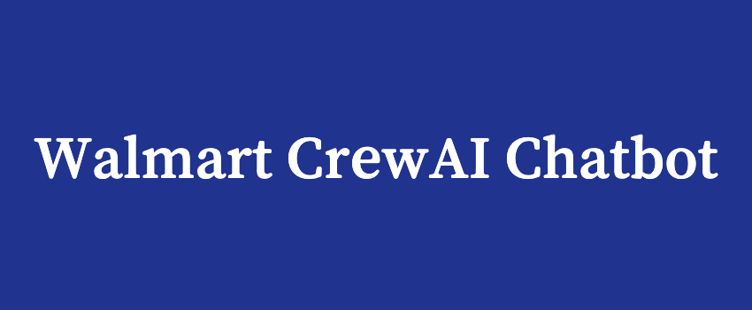

This is a chatbot created with CrewAI that acts as a Walmart Assistant. It is comprised of three main agents that work together to answer the user's questions if the input was approved by the initial guardrail agent. In addition to the chatbot, some features were created to ensure a better user experience, such as the ability to choose between short-term and long-term memory.

## Features

  - **Guardrails**: A model separate from the CrewAI Chatbot will evaluate the user's input and its relevance to Walmart before allowing it to reach the main logic
  - **Short-term Memory**: The Chatbot utilizes short-term memory as the conversation goes on and will use the user's past responses when formulating an output
  - **Long-term Memory**: The Chatbot can use long-term memory with the help of Mem0. It will perform a vector search to find the most relevant memories from both the user and the chatbot to provide a stronger answer
  - **Speech to Text**: Using FFMPEG and WhispherAI, the user can choose to speak out loud for an input
  - **Speed Optimization**: Utilizing memories can lead to long delays, so threading is used with long-term memory to improve speed and provide a better user experience

## Chatbot Flow Diagram


## Understanding The Crew

The Walmart CrewAI Chatbot is composed of multiple AI agents, each with unique roles, goals, and tools. The four main agents include:
  1. **Guardrail Agent**: This agent will take in the user's prompt and check if it is related to Walmart, Walmart services, and/or Walmart products. It will also be given the last three exchanges in the conversation between the chatbot and the user to ensure it has context of the current discussion. If it deems the user's input to be relevant and appropriate, it will rephrase the prompt and pass it to the CrewAI Agents
  2. **Walmart Research Agent**: This agent will take the prompt given by the guardrail agent and research information related to the user's question from verifiable Walmart sources. Once it has gathered its research, it will pass it on to the next agent
  3. **Walmart Summarizer Agent**: The research findings given by the Research Agent may not be very clear or contain unnecessary information. The summarizer agent will create a summary of the research findings that will be easy for the user to view
  4. **Walmart QA Agent**: This is the final agent that will review the summary and ensure the final summary is clear, concise, and aligned with Walmart's communication standards and policies. Once the final review is finished, it will give the user an output.

## Quick Start

### 1. Install Dependencies

```bash
pip install -r requirements.txt
```

### 2. Version checking
Ensure you have Python >=3.10 <3.14 installed on your system. This project uses [UV](https://docs.astral.sh/uv/) for dependency management and package handling, offering a seamless setup and execution experience.

### 3. If you haven't already, install uv:

```bash
pip install uv
```

### 4. Next, navigate to your project directory and install the dependencies:

(Optional) Lock the dependencies and install them by using the CLI command:
```bash
crewai install
```
### Customizing

**Add your `OPENAI_API_KEY`, `SERPER_API_KEY`, and `MEM0_API_KEY` into the `.env` file**

You can modify specific things to change the purpose of the Chatbot. This would include:

- Modify `src/crewai_knowledge_chatbot/config/agents.yaml` to define your agents
- Modify `src/crewai_knowledge_chatbot/config/tasks.yaml` to define your tasks
- Modify `src/crewai_knowledge_chatbot/crew.py` to add your own logic, tools, and specific args
- Modify `src/crewai_knowledge_chatbot/main.py` to add custom inputs for your agents and tasks, change the guardrail agent, and IDs for mem0

## Running the Project

To kickstart your crew of AI agents and begin task execution, run this from the root folder of your project:

```bash
$ crewai run
```

This command initializes the Crew, assembling the agents and assigning them tasks as defined in your configuration.

## License

MIT License - see LICENSE file for details.
